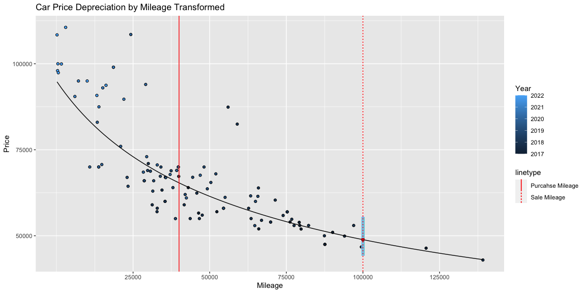
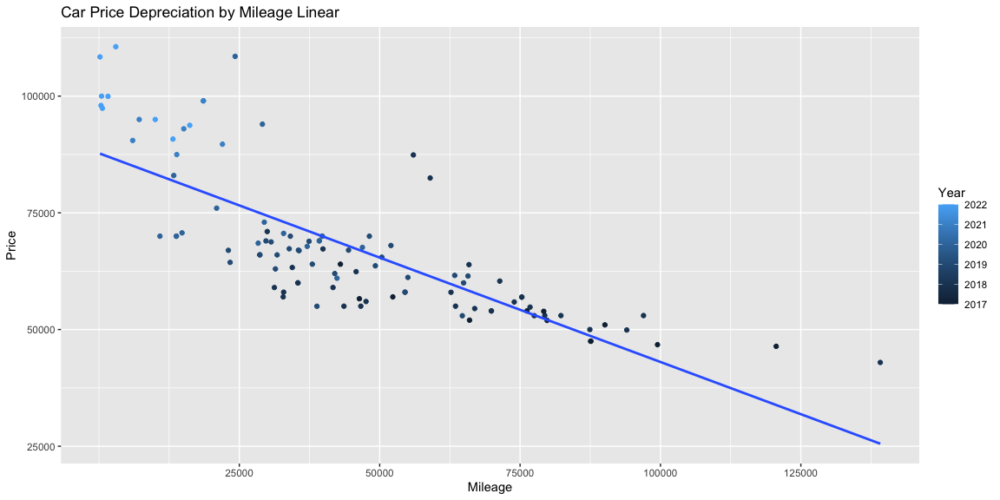

```r
#first linear model of the data. 

lm.cars <- lm(Price ~ Mileage, data=df)
# model <- summary(lm.cars)
# model

# plot(Price ~ Mileage, data=df)
# abline(lm.cars)


#plot(lm.cars)

# 
# boxCox(lm.cars)
# 
# 
# 
# y = sqrt(sqrt(df$Price))
# 
# lm_new <- lm(y ~ df$Mileage)
# summary(lm_new)
# 
# plot(lm_2, which=1)
#plot(lm_new, which=1)
#plot(lm_new)
# 

#plot(sqrt(sqrt(Price)) ~ Mileage, data=df)
# abline(lm_2)
#abline(lm_new)
# abline(4.20957099+0.2258 , -0.02893911, lty=2)

# abline(4.20957099-0.2258 , -0.02893911, lty=2)

## Make it meaningful!


#abline(lm.cars)
```

## Conclusion

I gathered data on a Ford Raptor, an off shoot of the f-150 series, between the years of 2017 and 2022. After preforming the analysis on the data that I gathered that the equation for the linear model that I made is as follows ${Y_i} = {85,110} - 0.4148{X_i}$ or as seen below. Based off of the model I determined that it would be best to purchase this vehicle at around 40,000 miles of according to the model for \$68,518. It would also be the best to sell the vehicle at around 100,000 miles at an estimated price of \$43,630. At an average of roughly 20,000 miles driven a year by the average motorist in america, you would retain the vehicle for 4 years and absorb roughly \$25,000 dollars of depreciation or roughly \$6500 dollars a year.

$$
  \underbrace{Y_i}_\text{Predicted Price} = \overbrace{85,110}^\text{y-int (Price)} - \overbrace{0.4148}^\text{slope} \underbrace{X_i}_\text{Mileage(Value Lost per Mile)} + \epsilon_i \quad \text{where} \ \epsilon_i \sim N(0, \sigma^2)
$$


```r
#y = sqrt(sqrt(df$Price))
y = (df$Price)^-2

lm_new <- lm(y ~ df$Mileage)
b <- coef(lm_new)


car <- lm(y ~ Mileage, data=df)

pred <- (predict(car, data.frame(Mileage=100000), interval="prediction"))^-(1/2)


last_plot <- ggplot(df, aes(x=Mileage, y=Price))+
  geom_point(shape=21, aes(fill=Year))+
  #geom_smooth(method="lm", se=F, formula=y~x, fullrange=TRUE)+
  geom_segment(aes(x=100000, xend=100000, y=pred[2], yend=pred[3]), lwd=2, color="skyblue", alpha=.05)+
  stat_function(fun = function(x) ((b[1] + b[2]*x)^-(1/2)), color='black')+
  geom_segment(aes(x=100000, xend=100000, y=pred[2], yend=pred[3]), lwd=2, color="skyblue", alpha=.0005)+
geom_point(aes(x=100000,y=48875.13),colour="firebrick")+
  geom_vline(aes(xintercept=40000, linetype="Purcahse Mileage"), color="red")+ 
  geom_vline(aes(xintercept=100000, linetype="Sale Mileage"), color="red")+
  ggtitle("Car Price Depreciation by Mileage Transformed")+
  scale_x_continuous(breaks = c(25000, 50000, 75000, 100000, 125000))+
  scale_y_continuous(breaks = c(25000, 50000, 75000, 100000, 125000))
  
last_plot
```

<!-- -->

The following is a summary of the regression from the transformation. The transformation made some of the values very small. The $R^2$ value stayed relatively the same. We can also see in the graph above that the blue bar represents the standard error for the prediction value given.


```r
#transformed summary 
pander(summary(lm_new))
```


----------------------------------------------------------------
     &nbsp;        Estimate    Std. Error   t value   Pr(>|t|)  
----------------- ----------- ------------ --------- -----------
 **(Intercept)**   1.108e-10    8.55e-12     12.96    1.636e-23 

 **df$Mileage**    3.078e-15   1.623e-16     18.96    1.09e-35  
----------------------------------------------------------------


-------------------------------------------------------------
 Observations   Residual Std. Error   $R^2$   Adjusted $R^2$ 
-------------- --------------------- ------- ----------------
     107             4.578e-11        0.774       0.7718     
-------------------------------------------------------------

Table: Fitting linear model: y ~ df$Mileage

## Hypothesis


This data was collected from from cars.com on the 30th(roughly) of September 2022. The data was focused on ford F-150's with the Raptor Trim. It should be noted that besides the based F-150 frame on the truck, virtually everything else about this vehicle is different. This is  important to note because this analysis will be focued on analyzing the depreciation of thjis specific vehicle over the miles driven and will mostly likely not be accurate in regards to other F-150 trucks of different trims. 

Hypothesis - The Null hypothesis is that there not be a correlation between the mileage and the price of the vehicle. The Alternative being that there is a correlation that indicates what the price will be at a certain mileage of a vehicle or in this case the F-150 being observed. 

$$ 
H_0:\beta_1 = 0\\
H_a:\beta_1 \neq 0 
$$


The true regression model assumed by a regression analysis is given by 

$$
  \underbrace{{Y_i}}_\text{Actual Price} = \overbrace{\beta_0}^\text{y-int} + \overbrace{\beta_1}^\text{slope} \underbrace{X_i}_\text{Mileage} + \epsilon_i \quad \text{where} \ \epsilon_i \sim N(0, \sigma^2)
$$

With ${\beta_0}$ representing the sale price high and the ${\beta_1}$ representing the depreciation value as mileage increases. The estimated regression line obtained from a transformed regression analysis, pronounced “y-hat”, is written as

$$
  \underbrace{\hat{Y}^{-2}_i}_\text{Predicted Transformed Price} = \overbrace{1.108e-10}^\text{est. y-int} + \overbrace{3.078e-15}^\text{est. slope} \underbrace{X_i}_\text{Mileage}
$$


In this transformed equation ${\beta_0}$ would be 17.23 and the est. slope of ${\beta_1}$ would be -2.62e-05. The equation that I used to predict the selling price at 100,000 miles was sum(coef(lm_new.lm)*c(1, 100,000)) = $43,630. The standard error for this regression is 1828 which is pretty tight for the price that these trucks are selling for. The p-value is 2.367e-23 which means that we will fail o reject the null for the analysis.

The following is the equation transformed back to represent the actual values of the line in this data set. It is gathered by taking the inverse of $Y^{-2}$ which is represented by $Y^{-1/2}$.

$$
  \underbrace{\hat{Y}_i}_\text{Predicted Price} = \frac{ 1 }{\sqrt{ {{1.108e-10}} + {3.078e-15} {X_i}}} 
$$


## Data 


This is the summary for the linear model of the Price plotted against the mileage. 


```r
#first linear model of the data. 

lm.cars <- lm(Price ~ Mileage, data=df)
model <- summary(lm.cars)
pander(model)
```


---------------------------------------------------------------
     &nbsp;        Estimate   Std. Error   t value   Pr(>|t|)  
----------------- ---------- ------------ --------- -----------
 **(Intercept)**    87772        1828       48.01    2.848e-73 

   **Mileage**     -0.4472     0.03471     -12.88    2.367e-23 
---------------------------------------------------------------


--------------------------------------------------------------
 Observations   Residual Std. Error   $R^2$    Adjusted $R^2$ 
-------------- --------------------- -------- ----------------
     107               9788           0.6126       0.6089     
--------------------------------------------------------------

Table: Fitting linear model: Price ~ Mileage

We can see in the graph below that the data would fit the line very well if it wasn't for the vehicles mad within the last couple of years. The discrepancy is most likely because Ford released a new model of this vehicle that has a V8 option that is increasing the price and manipulating the data. This is why we will be preforming a transformation to the line so that is will fit the data better.


```r
lm_plot <- ggplot(df, aes(x=Mileage, y=Price, color=Year))+
  geom_point()+
  geom_smooth(method="lm", se=F, formula=y~x, fullrange=TRUE)+
  scale_x_continuous(breaks = c(25000, 50000, 75000, 100000, 125000))+
  scale_y_continuous(breaks = c(25000, 50000, 75000, 100000, 125000))+
  ggtitle("Car Price Depreciation by Mileage Linear")


lm_plot
```

<!-- -->

```r
#abline(lm.cars)
#plot(lm.cars)
#shape=21, aes(fill=Year)
```


The graph below represents the box-cox transformation that is recommended for this data set. Box Cox transformation use a algorithm to manipulate a linear model to confirm with non-linear data. This transformation allows for a more accurate and meaningful model to fit to the data. The Box-cox transformation graph indicates a transformation of -2 to fit the model to the data. Since the data for cars is normally not linear we will be applying a transformation of $Y' = Y^{-2}$ to the data. This will make, or "bend", the linear model to better confirm with the data and have a more meaningful value. 


```r
boxCox(lm.cars)

# 
# 
# y = sqrt(sqrt(df$Price))
# 
# lm_new <- lm(y ~ df$Mileage)
# summary(lm_new)

# plot(lm_2, which=1)
# plot(lm_new, which=1)
#plot(lm_new)


#plot(sqrt(sqrt(Price)) ~ Mileage, data=df)
#abline(lm_2)
#abline(lm_new)
#abline(4.20957099+0.2258 , -0.02893911, lty=2)

abline(4.20957099-0.2258 , -0.02893911, lty=2)
```

<!-- -->

```r
## Make it meaningful!


#abline(lm.cars)
```

#### Data Set

This is the first five rows of the dataset.The data was collected from cars.com for F-150 raptors for within 250 miles of Rexburg, Idaho. I initially gathered the data for the trim in case there were not enough data point, or trucks for sale, of the trim that I wanted to do my analysis for. 


```r
# Imported Data sets from CSV files.

df <- read_csv("/Users/soren.laney/Desktop/Fall Semester 2022/Math 425 Applied Linear Regression/Analysis/Car Selling Analysis/Data/Used Car Prices Data.csv")
df %>% head(5) %>% pander()
```


-------------------------------------------------
 Make   Model    Trim    Year   Price    Mileage 
------ ------- -------- ------ -------- ---------
 Ford   F-150   Raptor   2022   110590    3001   

 Ford   F-150   Raptor   2022   108405     193   

 Ford   F-150   Raptor   2022   99997      470   

 Ford   F-150   Raptor   2022   99947     1615   

 Ford   F-150   Raptor   2022   97997      369   
-------------------------------------------------
