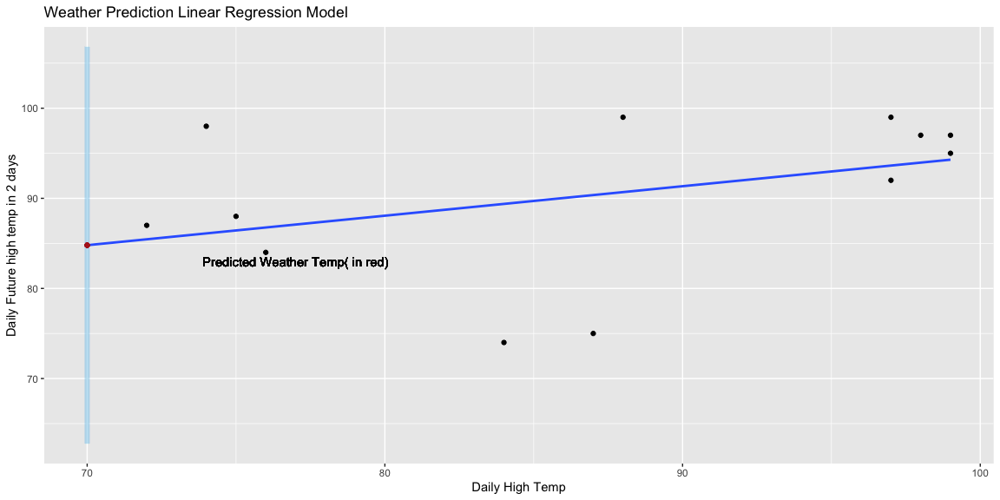
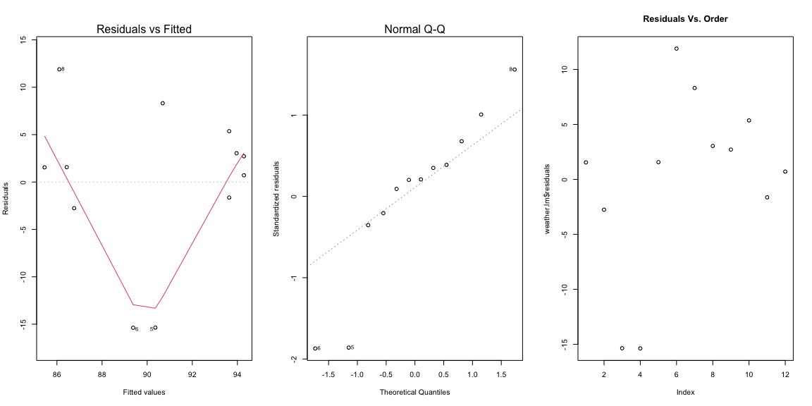

```r
# Use this R-Chunk to load all your libraries!
#install.packages("tidyverse") # run this line once in console to get package
library(tidyverse)
library("readxl")
library(lubridate)
library(skimr)
library(vtable)
library(jtools)
library(huxtable)
library(mosaic)
library(car)
#cntrl opt i new r chuck
```


```r
# Use this R-Chunk to import all your datasets!
df <- read_xlsx("/Users/soren.laney/Desktop/BYUI/Fall Semester 2022/Math 425 Applied Linear Regression/Analysis/Predicting the Weather/Data/Predict_Weather_Data.xlsx")

# df %>% 
#   head(5)

#notes
#Do not predict the weather based off of the date. 

df_new <- df %>% 
  mutate(Temp_future = lag(Temp, 2)) %>% 
  na.omit()
#df_new

weather.lm <- lm(Temp ~ Temp_future, data=df_new)
#summary(weather.lm)

pred.w84 <- predict(weather.lm, data.frame(Temp_future=70), interval="prediction")
```


## Conclusions


I predict based on the linear model that the high temperature Monday will be 84.8 degrees Fahrenheit with a prediction interval of 62.77 and 106.83 degrees.


```r
# Use this R-Chunk to plot & visualize your data!


#weather.lm_hum <- lm(Wind ~ Temp, data=df)
#summary(weather.lm_hum)

graph <- ggplot(weather.lm, aes(x = Temp_future, y = Temp)) +
  geom_point()+
  geom_smooth(method="lm", se=F, formula=y~x, fullrange=TRUE)+
    scale_color_manual("Status")+
    geom_text(data = weather.lm, aes(x = 77, y = 83, label = "Predicted Weather Temp( in red)"))+
    theme(legend.position = "none")+
    theme()+
  #geom_hline(yintercept = 84.7982, color = "firebrick", size = 1, linetype = "longdash", alpha = .5)+
  labs(title = "Weather Prediction Linear Regression Model", x = "Daily High Temp", y = "Daily Future high temp in 2 days") + 
  geom_segment(aes(x=70, xend=70, y=pred.w84[2], yend=pred.w84[3]), lwd=2, color="skyblue", alpha=.05)+
  geom_point(aes(x=70,y=84.7982),colour="firebrick")
graph
```

<!-- -->

```r
#predict(weather.lm, data.frame(Temp_future=70))
```

Upon analyzing the data it appears that to be normal under a QQ plot and scatter. However, under the residuals, it appeared to not be normal. It curves sharply down and then back up making a v-shape. Due to this I do not believe that my data bring a significant result. 

To predict the high temp on Monday I used the temp plotted against itself on a 2 day lag so that I could use the high from Saturday to predict the temp on Monday. The estimated equation from the analysis is as seen below.


## Hypothesis 
This data was collected from this website(https://www.timeanddate.com/weather/@5605242/historic?month=1&year=2022) on the 15th of September 2022. I gathered the date, Wind speed, Temp and Humidity from the 1st of September until the 15th of September. The data was collected for the purpose of predicting the weather on Monday the 19th of September. The temperature will be estimated by using the lag data from two days prior to predict the temperature using a linear regression model. 

Hypothesis - The Null hypothesis is that there not be a correlation between the high temperature two days in the future and today's current high temperature. The Alternative being that there is a correlation that indicates what the temperature will be two days in the future from today's high. 

$$ 
H_0:\beta_1 = 0\\
H_a:\beta_1 \neq 0 
$$


The true regression model assumed by a regression analysis is given by 

$$
  \underbrace{Y_i}_\text{Actual Temperature} = \overbrace{\beta_0}^\text{y-int} + \overbrace{\beta_1}^\text{slope} \underbrace{X_i}_\text{High Temp} + \epsilon_i \quad \text{where} \ \epsilon_i \sim N(0, \sigma^2)
$$

With ${\beta_0}$ representing the temperature high and the ${\beta_1}$ representing the lag temperature. The estimated regression line obtained from a regression analysis, pronounced “y-hat”, is written as

$$
  \underbrace{\hat{Y}_i}_\text{Predicted Temp} = \overbrace{61.88}^\text{est. y-int} + \overbrace{0.3273}^\text{est. slope} \underbrace{X_i}_\text{High Temp}
$$


In this equation ${\beta_0}$ would be being 61.88 and the est. slope of ${\beta_1}$ being 0.3273. The equation that I used to predict the high on Monday was sum(coef(weather.lm)*c(1, 70)) = 84.7982. After preforming a summary statistic on the linear regression, I found there to be a p-value of .2049 and a standard error of8.626, making the result not significant or highly concentrated. This is most likely a Type 1 error as the evidence suggests that should retain the null hypothesis. This is because of the data I choose to use in my linear regression. I picked the the dates of the 1st to the 15th to use. The temperature of the last two weeks was not similar to the weather leading into this weekend. This leads me to believe that my prediction of the high being roughly 84.8 degrees on Monday will not be accurate.  


## Regression Appropriateness

The residuals vs. fitted graph and Residuals vs. Order are cause for concern regarding the normality of the data. The QQ plot is relatively normal until the data trails up to the right. Ideally with better conditions to collect data, I would collect data for the same time peroid over multiple year to normalize it.


```r
weather.lm <- lm(Temp ~ lag(Temp, 2), data=df)
par(mfrow=c(1,3))

#residuals vs. fitted-values plo
plot(weather.lm, which=1:2)


# residuals vs. order
plot(weather.lm$residuals,
     main="Residuals Vs. Order")
```

<!-- -->

```r
#sum(coef(weather.lm)*c(1, 70))
```


## Analysis


```r
summary <- summ(weather.lm)
summary
```

<table class="table table-striped table-hover table-condensed table-responsive" style="width: auto !important; margin-left: auto; margin-right: auto;">
<tbody>
  <tr>
   <td style="text-align:left;font-weight: bold;"> Observations </td>
   <td style="text-align:right;"> 12 (2 missing obs. deleted) </td>
  </tr>
  <tr>
   <td style="text-align:left;font-weight: bold;"> Dependent variable </td>
   <td style="text-align:right;"> Temp </td>
  </tr>
  <tr>
   <td style="text-align:left;font-weight: bold;"> Type </td>
   <td style="text-align:right;"> OLS linear regression </td>
  </tr>
</tbody>
</table> <table class="table table-striped table-hover table-condensed table-responsive" style="width: auto !important; margin-left: auto; margin-right: auto;">
<tbody>
  <tr>
   <td style="text-align:left;font-weight: bold;"> F(1,10) </td>
   <td style="text-align:right;"> 1.84 </td>
  </tr>
  <tr>
   <td style="text-align:left;font-weight: bold;"> R² </td>
   <td style="text-align:right;"> 0.16 </td>
  </tr>
  <tr>
   <td style="text-align:left;font-weight: bold;"> Adj. R² </td>
   <td style="text-align:right;"> 0.07 </td>
  </tr>
</tbody>
</table> <table class="table table-striped table-hover table-condensed table-responsive" style="width: auto !important; margin-left: auto; margin-right: auto;border-bottom: 0;">
 <thead>
  <tr>
   <th style="text-align:left;">   </th>
   <th style="text-align:right;"> Est. </th>
   <th style="text-align:right;"> S.E. </th>
   <th style="text-align:right;"> t val. </th>
   <th style="text-align:right;"> p </th>
  </tr>
 </thead>
<tbody>
  <tr>
   <td style="text-align:left;font-weight: bold;"> (Intercept) </td>
   <td style="text-align:right;"> 61.89 </td>
   <td style="text-align:right;"> 21.18 </td>
   <td style="text-align:right;"> 2.92 </td>
   <td style="text-align:right;"> 0.02 </td>
  </tr>
  <tr>
   <td style="text-align:left;font-weight: bold;"> lag(Temp, 2) </td>
   <td style="text-align:right;"> 0.33 </td>
   <td style="text-align:right;"> 0.24 </td>
   <td style="text-align:right;"> 1.36 </td>
   <td style="text-align:right;"> 0.20 </td>
  </tr>
</tbody>
<tfoot><tr><td style="padding: 0; " colspan="100%">
<sup></sup> Standard errors: OLS</td></tr></tfoot>
</table>

```r
# table <- export_summs(weather.lm, scale = TRUE)
# table
```


