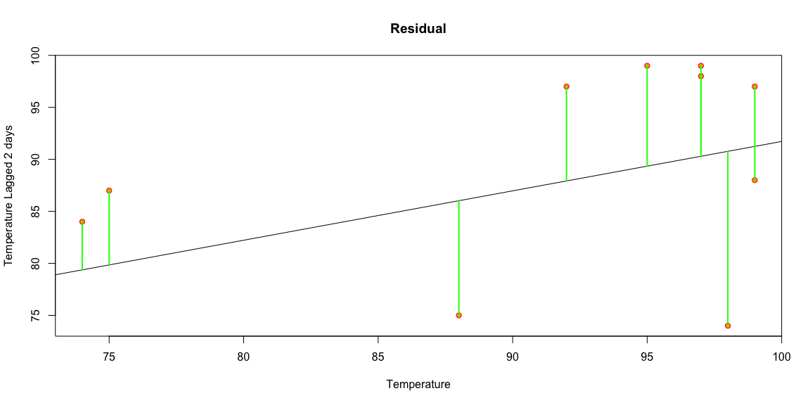
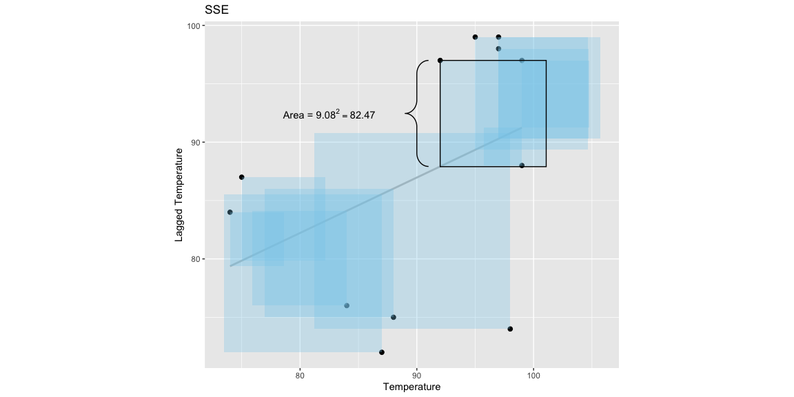
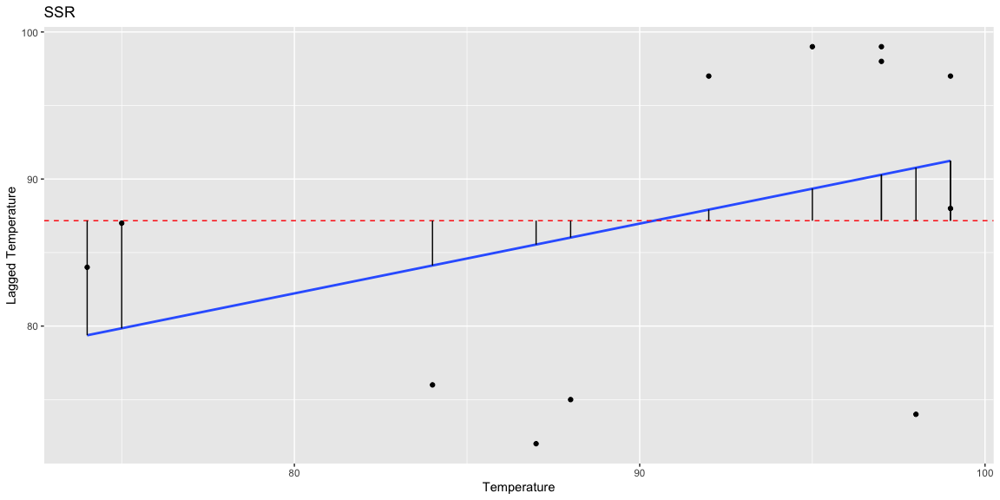
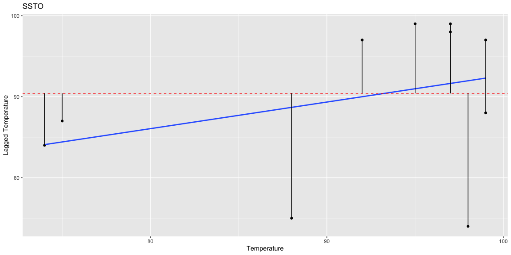
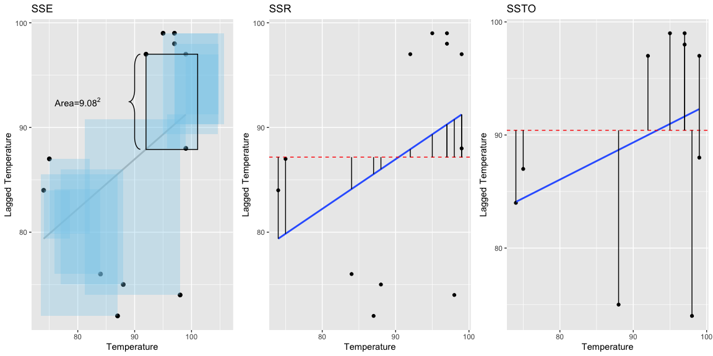
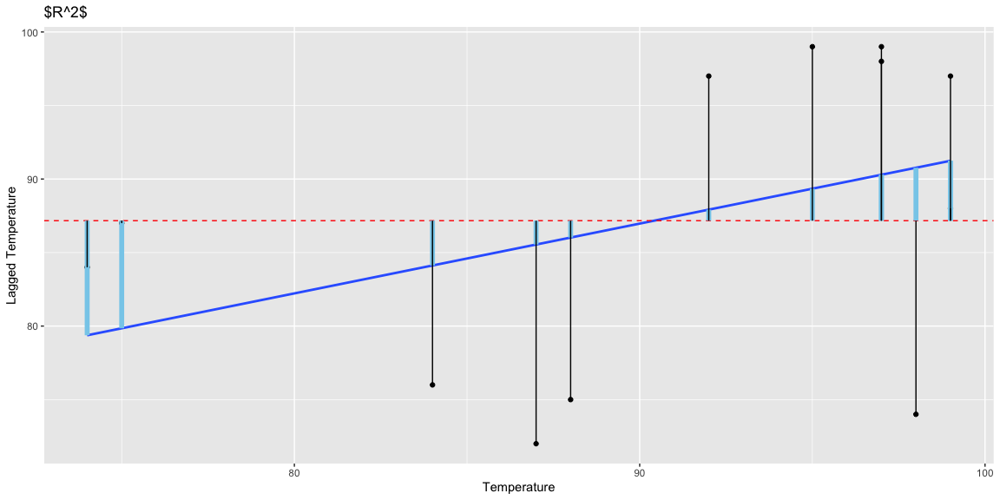

## Residual 

Definition - A residual is the difference between an observed value and a predicted value in a regression analysis. In a regression analysis, a single residual value, tells us the difference in the predicted value and the observed value for that data point. For example, in the weather prediction analysis, the residual of the high temp for that day that was predicted(84 degrees) tells the difference of that and the actual high temp(81 degrees) giving the residual a value of 3. The mathematical equation defining a residual is as follows. 

We will denote a **residual** for individual $i$ by $r_i$,
$$
  r_i = \underbrace{Y_i}_{\substack{\text{Observed} \\ \text{Y-value}}} - \underbrace{\hat{Y}_i}_{\substack{\text{Predicted} \\ \text{Y-value}}} \quad \text{(residual)}
$$
The residual $r_i$ estimates the true **error** for individual $i$, $\epsilon_i$, 
$$
  \epsilon_i = \underbrace{Y_i}_{\substack{\text{Observed} \\ \text{Y-value}}} - \underbrace{E\{Y_i\}}_{\substack{\text{True Mean} \\ \text{Y-value}}} \quad \text{(error)}
$$

In summary...


| Residual $r_i$ | Error $\epsilon_i$ |
|----------------|--------------------|
| Distance between the dot $Y_i$ and the estimated line $\hat{Y}_i$ | Distance between the dot $Y_i$ and the true line $E\{Y_i\}$. |
| $r_i = Y_i - \hat{Y}_i$ | $\epsilon_i = Y_i - E\{Y_i\}$ |
| Known | Typically Unknown |


```r
#yhat=weather.lm$fitted.values*x

weather_residuals <- plot(x,y,
     pch=21,col="red",bg="orange",
     xlab="Temperature",
     ylab="Temperature Lagged 2 days",
     main="Residual")
abline(weather.lm)
#points(x,yhat,pch=22,col="black",bg="blue")
for (i in 1:20) {
  lines(c(x[i],x[i]),c(y[i],weather.lm$fitted.values[i]),lwd=2,col="green")
}
```

<!-- -->

```r
#weather_residuals
```

## {.tabset .tabset-pills }

### SSE
Definition - The Sum of Squares due to Errors is the measure of the total deviation of the response values from the fit to the response values. It is also called the summed square of residuals and is usually labelled as SSE.

It is mathematically defined as the following. Here $Y_i$ is the observed value while $\hat{Y}_i$ is the predicted value from the fit. A value closer to 0 indicates the the model has a smaller standard error component and the model will be more useful for prediction. It is calculated summing the squares of the difference in $Y_i$ (the observed values) and $\hat{Y}_i$(The estimated Values). In the case of the Weather Analysis prediction, we are summing the difference of the predicted line($\hat{Y}_i$ or Temp_lag, the lagged temperature) and the actual temperature. 

$$
 \text{SSE} = \sum_{i=1}^n \left(Y_i - \hat{Y}_i\right)^2 = 744.1
$$

In the Predicting Weather Analysis it is predicted as seen below. The SSE for the analysis is 744.1 indicating that the linear model while be less useful for predicting future values because it is much larger than zero and the values are not well fitted to the line. 

```r
rPoint <- df %>% filter(Temp == 92)
#rPoint

xvar <- df$Temp
ymin <- df$Temp_lag

SSE <- sum((df$Temp_lag - weather.lm$fit)^2)

ggplot(df, aes(x=Temp, y=Temp_lag)) + 
  geom_point(size=2) + 
  geom_smooth(method = "lm", se=FALSE, formula = 'y ~ x', color="grey") + 
  geom_rect(
    aes(xmin=Temp, xmax=Temp+weather.lm$residuals, 
        ymin=Temp_lag, ymax=weather.lm$fitted.values),
    alpha=.3,
    fill="skyblue") +

# individual SSE
  geom_rect(
    data=rPoint, 
    aes(xmin=Temp, xmax=97+4.0813, ymin=87.9, ymax=Temp_lag), 
    color="black", alpha=0) +
  coord_fixed()+
  geom_text(
    data=rPoint, 
    aes(x=Temp-(19/2), y=Temp_lag-(9.08/2)), 
    label=TeX("Area = $9.08^2 = 82.47$")) +
  geom_brace(aes(x=c(89,91), y=c(rPoint$Temp_lag, 87.9187)), inherit.data=FALSE, rotate = 270) +
  geom_label(
    x=86, y=69.1, 
    label="15.8", 
    label.size = NA) +
  xlab("Temperature") + ylab("Lagged Temperature")+
  ggtitle("SSE")
```

<!-- -->


### SSR 

Definition - The sum of differences in the predicted value and the mean dependent variable. In the Weather Analysis, the mean dependent variable is the Temperature. If the SSR value is equal to the Sum of Squares total, it means that the regression model has captured all of the observed variability and is perfect. 

It is mathematically defined as the following.

$$
\text{SSR} = \sum_{i=1}^n \left(\hat{Y}_i - \bar{Y}\right)^2
$$

In the weather prediction analysis, we use the mean temperature to calculate the the SSR. We find, as shown in the code below, that the SSR is 202.86 for the linear model. This is a measure of how much the regression line deviates from the average y-value. It is represented in the visual below. The red line represents the the distance between the observed points and the estimated line.

```r
SSR <- sum((weather.lm$fit - mean(df$Temp_lag))^2)
#SSR


polt_Weather_SSR <- ggplot(df, aes(x=Temp, y=df$Temp_lag))+
  geom_point()+
  geom_smooth(method = lm, se=F, formula=y~x)+
  geom_hline(yintercept=mean(df$Temp_lag), linetype="dashed", color = "red")+
  geom_segment(aes(x=Temp, xend=Temp, y=weather.lm$fit, yend=mean(Temp_lag)))+
  xlab("Temperature") + ylab("Lagged Temperature")+ 
  ggtitle("SSR")
polt_Weather_SSR
```

<!-- -->

### SSTO

Definition -  It is the squared difference between the observed dependent variable and it's mean. It is like the dispersion of the observed variables around the mean.

It is mathematically defined as the following.

$$
\text{SSTO} = \sum_{i=1}^n \left(Y_i - \bar{Y}\right)^2
$$

Below is the SSTO for the Weather Prediction analysis and is found to 1350.93. It is represented in the graph below as the difference of the observed values and y-bar.

```r
SSTO <- sum((df$Temp_lag - mean(df$Temp_lag))^2)
#SSTO

polt_Weather_SSTO <- ggplot(df, aes(x=Temp, y=lag(df$Temp, 2)))+
  geom_point()+
  geom_smooth(method = lm, se=F, formula=y~x)+
  geom_hline(yintercept=mean(df$Temp), linetype="dashed", color = "red")+
  geom_segment(aes(x=Temp, xend=Temp, y=lag(df$Temp, 2), yend=mean(df$Temp)))+
  xlab("Temperature") + ylab("Lagged Temperature")+ 
  ggtitle("SSTO")
polt_Weather_SSTO
```

<!-- -->


##

### SSE, SSR & SSTO Together


Below is a comparison of all three of these measurement side by with their respective equations and graphs.This is modeled after the BYU-I Stats notebook that can be found online. We can see that they can be used to calculate the values of each other because given the same four values you can calculate any one of them. We can also see that we would would to have a mixture of good values for all o these in a linear model for the model to be really effective in the real world. 


| **Sum of Squared Errors** | **Sum of Squares Regression** | **Total Sum of Squares** |
|---------------------------|-------------------------------|--------------------------|
| $\text{SSE} = \sum_{i=1}^n \left(Y_i - \hat{Y}_i\right)^2$ | $\text{SSR} = \sum_{i=1}^n \left(\hat{Y}_i - \bar{Y}\right)^2$ | $\text{SSTO} = \sum_{i=1}^n \left(Y_i - \bar{Y}\right)^2$ |
|Measures how much the residuals deviate from the line. | Measures how much the regression line deviates from the average y-value. | Measures how much the y-values deviate from the average y-value.|
| Equals SSTO - SSR | Equals SSTO - SSE | Equals SSE + SSR |
| `sum( (Y - mylm$fit)^2 )` | `sum( (mylm$fit - mean(Y))^2 )` | `sum( (Y - mean(Y))^2 )` |


```r
library(gridExtra)
par(mfrow=c(1,3), mai=c(.01,.4,.4,.01))
## SSE

SSE_Plot <- ggplot(df, aes(x=Temp, y=Temp_lag)) + 
  geom_point(size=2) + 
  geom_smooth(method = "lm", se=FALSE, formula = 'y ~ x', color="grey") + 
  geom_rect(aes(xmin=Temp, xmax=Temp+weather.lm$residuals, 
        ymin=Temp_lag, ymax=weather.lm$fitted.values),
    alpha=.3,
    fill="skyblue") +

# individual SSE
  geom_rect(
    data=rPoint, 
    aes(xmin=Temp, xmax=97+4.0813, ymin=87.9, ymax=Temp_lag), 
    color="black", alpha=0) +
  geom_text(
    data=rPoint, 
    aes(x=Temp-(24/2), y=Temp_lag-(9.08/2)), 
    label=TeX("Area=$9.08^2$")) +
  geom_brace(aes(x=c(89,91), y=c(rPoint$Temp_lag, 87.9187)), inherit.data=FALSE, rotate = 270) +
  geom_label(
    x=86, y=69.1, 
    label="15.8", 
    label.size = NA) +
  xlab("Temperature") + ylab("Lagged Temperature")+ 
  ggtitle("SSE")


#SSR


#SSR <- sum((weather.lm$fit - mean(df$Temp_lag))^2)
#SSR


SSR <- (polt_Weather_SSTO <- ggplot(df, aes(x=Temp, y=df$Temp_lag))+
  geom_point()+
  geom_smooth(method = lm, se=F, formula=y~x)+
  geom_hline(yintercept=mean(df$Temp_lag), linetype="dashed", color = "red")+
  geom_segment(aes(x=Temp, xend=Temp, y=weather.lm$fit, yend=mean(Temp_lag))))+
  xlab("Temperature") + ylab("Lagged Temperature")+ 
  ggtitle("SSR")


#SSTO 

SSTO <- sum((df$Temp - mean(df$Temp))^2)
#SSTO

polt_Weather_SSTO <- ggplot(df, aes(x=Temp, y=lag(df$Temp, 2)))+
  geom_point()+
  geom_smooth(method = lm, se=F, formula=y~x)+
  geom_hline(yintercept=mean(df$Temp), linetype="dashed", color = "red")+
  geom_segment(aes(x=Temp, xend=Temp, y=lag(df$Temp, 2), yend=mean(df$Temp)))+
  xlab("Temperature") + ylab("Lagged Temperature")+ 
  ggtitle("SSTO")


require(gridExtra)
grid.arrange(SSE_Plot, SSR, polt_Weather_SSTO, ncol=3)
```

<!-- -->


## R-Squared ~ $R^2$

Definition - R-squared ($R^2$) is a statistical measure that represents the proportion of the variance for a dependent variable that's explained by an independent variable or variables in a regression model. In general, the higher the $R^2$ value or closer to one, the better. This is because it represents how well your model fits your observed values. This reefers to how $R^2$ is calculated which is 1 - sum of squares regression of SRR. SSR represents the distance (squared) from $\hat{Y}_i$ to $\bar{Y}$, and by subtracting that value from one you see how closely the data  is in relation to the estimated line. The graphs above represent the correlation of SSE, SSR and SSTO. This correlation is presented as $R^2$ 

It is represented mathematically below as

$$
  \underbrace{R^2 = \frac{SSR}{SSTO} = 1 - \frac{SSE}{SSTO}}_\text{Interpretation: Proportion of variation in Y explained by the regression.}
$$


```r
R2 <- polt_Weather_SSTO <- ggplot(df, aes(x=Temp, y=df$Temp_lag))+
  geom_point()+
  geom_smooth(method = lm, se=F, formula=y~x)+
  geom_hline(yintercept=mean(df$Temp_lag), linetype="dashed", color = "red")+
  geom_segment(aes(x=Temp, xend=Temp, y=weather.lm$fit, yend=mean(Temp_lag)), size=2, color='skyblue')+
  geom_segment(aes(x=Temp, xend=Temp, y=df$Temp_lag, yend=mean(df$Temp_lag)))+
  labs(x = "Temperature", y = "Lagged Temperature", title = "$R^2$")
R2
```

<!-- -->


```r
# Use this R-Chunk to import all your datasets!

# What is R-squared? It's definition is a simple statement "The proportion of variability in Y than can be explained by the regression." (Make sure you include this definition.) But understanding this definition can be tricky. Focus on the words "proportion," "variability," and "explained." Discuss these words. Visualize them. Refer back to your original explanations of the SS's.
# How is R-squared properly interpreted? How is it calculated? What information does it provide about a regression analysis? How does it differ from the information provided in the p-value for the slope term? 
# 
# Be sure to demonstrate the R-squared mathematically, graphically, and with written explanations. There are many ways to graphically show R-squared. Be creative as you come up with a way to visualize it.

# 1) A graphic or multiple graphics demonstrating that concept,
# 2) The mathematical formula defining that concept,
# 3) Written explanations explaining what values are possible for that concept, and what different values tell us about the regression.
```

## Residual MSE & Residual Standard Error

## {.tabset .tabset-pills }

### MSE 

Definition- MSE stands for Mean Squared Error. The mean squared error or mean squared deviation of an estimator measures the average of the squares of the errors—that is, the average squared difference between the estimated values and the actual value. MSE is a risk function, corresponding to the expected value of the squared error loss.

It is represented mathematically as seen below. In the Weather Prediction model we can see that that the MSE is 62.0046. The lower the value the better because if the MSE was 0, it would mean that the model has no error in it. The graph below represents the MSE.  

$$
\text{MSE} = \frac{1}{n-2} \sum_{i=1}^n \left(Y_i - \hat{Y_i}\right)^2
$$


```r
rPoint <- df %>% filter(Temp == 92)
#rPoint

xvar <- df$Temp
ymin <- df$Temp_lag

SSE <- sum((df$Temp_lag - weather.lm$fit)^2)

ggplot(df, aes(x=Temp, y=Temp_lag)) + 
  geom_point(size=2) + 
  geom_smooth(method = "lm", se=FALSE, formula = 'y ~ x', color="grey") + 
  geom_rect(
    aes(xmin=Temp, xmax=Temp+weather.lm$residuals, 
        ymin=Temp_lag, ymax=weather.lm$fitted.values),
    alpha=.3,
    fill="skyblue") +

# individual SSE
  geom_rect(
    data=rPoint, 
    aes(xmin=Temp, xmax=97+4.0813, ymin=87.9, ymax=Temp_lag), 
    color="black", alpha=0) +
  coord_fixed()+
  geom_text(
    data=rPoint, 
    aes(x=Temp-(19/2), y=Temp_lag-(9.08/2)), 
    label=TeX("Average Area = $10.39^2 = 107.95$")) +
  geom_brace(aes(x=c(89,91), y=c(rPoint$Temp_lag, 87.9187)), inherit.data=FALSE, rotate = 270) +
  geom_label(
    x=86, y=69.1, 
    label="15.8", 
    label.size = NA) +
  xlab("Temperature") + ylab("Lagged Temperature")+
  ggtitle("MSE")
```

<!-- -->


### Residual Standard Error


Residuals, as stated prior, are the distance between the observed value $Y_i$ and the estimated value of $\hat{Y}_i$. The Residual standard error is also know as the Root Mean Squared Error. It is found by taking the square root of the mean stand error, giving the approximated average distance of a residual from the estimated line. The RMSE or the residual standard error predicts $\sigma$ for the error term of $\epsilon_i$. The residual error is the difference between the observed value and the actual regression relation for that point $E${$Y_i$}. The residual error is represented by the following equation.  


$$
  \epsilon_i = \underbrace{Y_i}_{\substack{\text{Observed} \\ \text{Y-value}}} - \underbrace{E\{Y_i\}}_{\substack{\text{True Mean} \\ \text{Y-value}}} \quad \text{(error)}
$$


##


```r
# Use this R-Chunk to import all your datasets!

# . What do the letters "MSE" stand for? How large can MSE get? How small? Does it measure the same thing that R-squared measures, or something different? Is it related to R-squared? How does it compare to the "residual standard error"? Where can you find the residual standard error in the regression summary output in R? Do we want the MSE and residual standard error to be large or small? Why? What units of measurement do both MSE and residual standard error have relative to the original data? In contrast, what units of measurement does R-squared have with respect to the original data? (For example, with the weather data, the units for high temperature are likely in "degrees Fahrenheit." So are any of the MSE, residual standard error, or R-squared in the same units of "degrees Fahrenheit"?)

# 1) A graphic or multiple graphics demonstrating that concept,
# 2) The mathematical formula defining that concept,
# 3) Written explanations explaining what values are possible for that concept, and what different values tell us about the regression.
```


