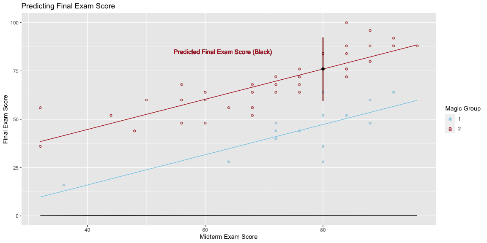
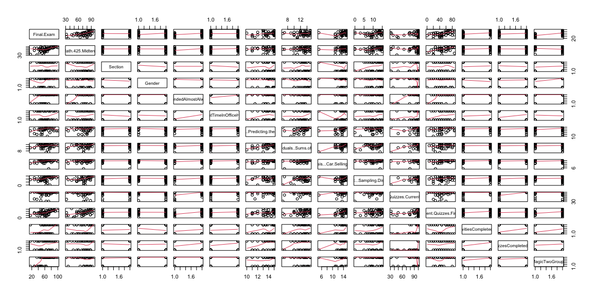
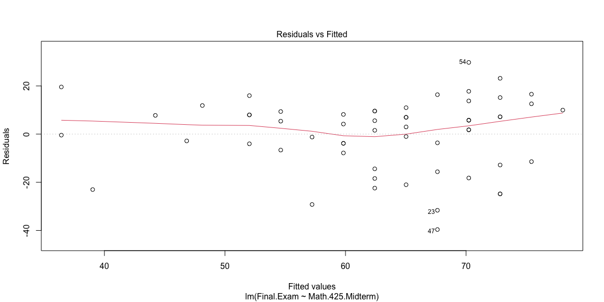
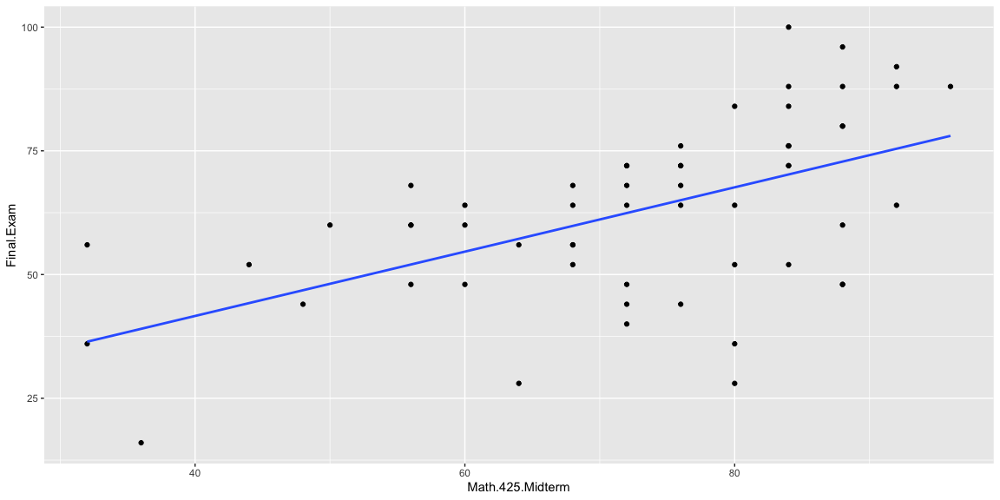
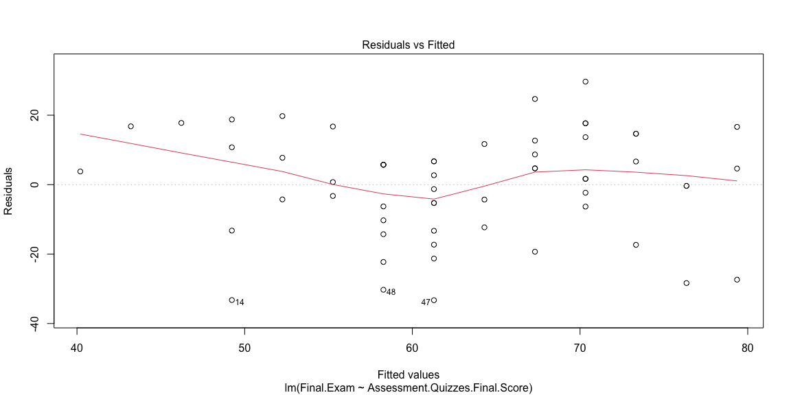
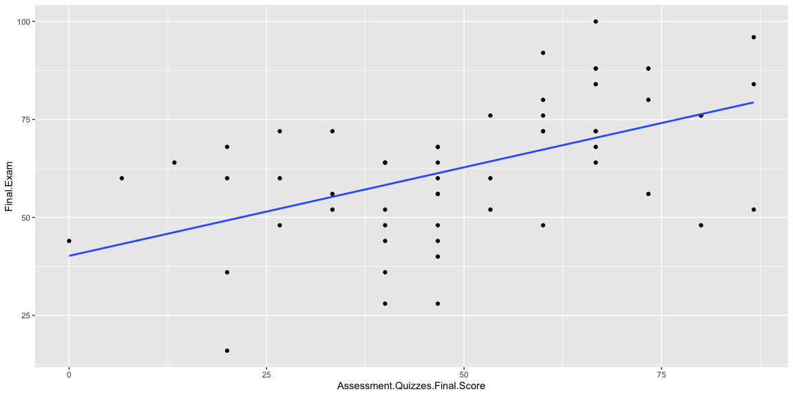

## Conclusion 


Based off of the following regression and analysis I predict that my final exam score is going to be 76% with a prediction interval of 59.6% to 92.39%, assuming that I am in group 2. My midterm exam score was 80%, 4% higher than my predicted final exam score and I will therefore keep my midterm exam score. 

```r
lm_midterm <- lm(Final.Exam ~ Math.425.Midterm + as.factor(MagicTwoGroups), data = df)


pred <- predict(lm_midterm, data.frame(Math.425.Midterm = 80, MagicTwoGroups = 2), data = df, interval = "prediction")
#pander(pred)

b <- coef(lm_midterm)
# Then b will have 4 estimates:
# b[1] is the estimate of beta_0: -9.0099
# b[2] is the estimate of beta_1:  1.4385
# b[3] is the estimate of beta_2: -14.5107
# b[4] is the estimate of beta_3: 1.3214

Plot_1 <- ggplot(df, aes(y = Final.Exam, x = Math.425.Midterm, color = factor(MagicTwoGroups))) +
  geom_point(pch = 21, bg = "gray83") +
  stat_function(fun = function(x) b[1] + b[2]*x, color = "skyblue") + #am==0 line
  stat_function(fun = function(x) (b[1] + b[3]) + (b[2])*x,color = "firebrick") + 
  scale_color_manual(name = "Magic Group", values = c("skyblue","firebrick")) +
  labs(title = "Predicting Final Exam Score") +
  geom_segment(aes(x = 80, xend = 80, y = pred[2], yend = pred[3]), lwd = 2, color = "firebrick", alpha = .0075) +
  stat_function(fun = function(x) ((b[1] + b[2]*x)^-(1/2)), color = 'black') +
  geom_point(aes(x = 80,y = 76.0144),colour = "black") +
  geom_text(data = df, aes(x = 63, y = 85, label = "Predicted Final Exam Score (Black)"))+
  labs(x = "Midterm Exam Score", y = "Final Exam Score")
  #geom_hline(aes(yintercept=44.8, linetype="Group 1 Final Exam Mean"), color="black")+ 
  #geom_hline(aes(yintercept=69.2093, linetype="Group 2 Final Exam Mean"), color="black")


Plot_1
```

<!-- -->

```r
#pairs(cbind(Res = lm_midterm$residuals, df), panel=panel.smooth, col=as.factor(df$MagicTwoGroups))
```

#### Linear Model Summary

```r
pander(summary(lm_midterm))
```


------------------------------------------------------------------------------
             &nbsp;               Estimate   Std. Error   t value   Pr(>|t|)  
-------------------------------- ---------- ------------ --------- -----------
        **(Intercept)**            -15.29       5.83      -2.623     0.01127  

      **Math.425.Midterm**         0.7824     0.07091      11.03    1.461e-15 

 **as.factor(MagicTwoGroups)2**    28.71       2.448       11.73    1.361e-16 
------------------------------------------------------------------------------


--------------------------------------------------------------
 Observations   Residual Std. Error   $R^2$    Adjusted $R^2$ 
-------------- --------------------- -------- ----------------
      58               8.059          0.8027       0.7955     
--------------------------------------------------------------

Table: Fitting linear model: Final.Exam ~ Math.425.Midterm + as.factor(MagicTwoGroups)


## Hypothesis 
This data was collected from previous Math 425 classes by brother Saunders. For this linear model we will be using a multiple linear regression model to 

Hypothesis - There will be a correlation in the grade that students in both group 1 and group 2 receive on their midterm exam and the grade that students receive on their final exam. 

$$ 
H_0:\beta_1 = 0\\
H_a:\beta_1 \neq 0 
$$


The true regression model assumed by a regression analysis is given by 

$$
  \underbrace{Y_i}_\text{Actual Final Exam Score} = \overbrace{\beta_0}^\text{y-int} + \overbrace{\beta_1}^\text{slope} \underbrace{X_{1i}}_\text{Midterm Exam} + \overbrace{\beta_2}^\text{slope}\underbrace{X_{2i}}_\text{Group}  + \epsilon_i \quad \text{where} \ \epsilon_i \sim N(0, \sigma^2)
$$

$$
{X_{2i}}  = [1, Group 1], [2, Group 2]
$$


With ${\beta_0}$ representing the y intercept ${\beta_1}$ representing the midterm exam score, and ${\beta_2}$ representing which group a student is in. The estimated regression line obtained from a regression analysis, pronounced “y-hat”, is written as

$$
  \underbrace{\hat{Y_i}}_\text{Predicted Final Exam Score} = \overbrace{-15.29}^\text{y-int} + \overbrace{0.7824}^\text{slope} \underbrace{X_{1i}}_\text{Midterm Exam} + \overbrace{28.71}^\text{slope}\underbrace{X_{2i}}_\text{Group} + \epsilon_i \quad \text{where} \ \epsilon_i \sim N(0, \sigma^2)
$$


In this equation ${\beta_0}$ would be being -15.29 and the est. slope of ${\beta_1}$ being 0.7824 and ${\beta_2}$ being 28.71. The equation used to predict a final exam score is predict(lm_midterm, data.frame(Math.425.Midterm = 80, MagicTwoGroups = 2), data = df, interval = "prediction")  = 76. After preforming a summary statistic on the linear regression, I found there to be a p-value of 1.461e-15 for ${\beta_1}$ and 1.361e-16 for ${\beta_2}$ making the regression significant. More importantly however is the adjusted $R^2$ value of 0.7955 which is less than ideal. While this presents that this model does represent a large portion of the data, it does not represent all of the data.This means that even though the given given prediction for this model is a final exam score of 76%, there is a roughly 20% that the true result is not represented in the data and can differ highly. 


## Apendix 

These are some of the pair plots and linear models that I tried to find relationships in. I cycled through all of the x variables comparing them to the predicted variable of the final exam score. I didn't find anything that had better correlation than using the midterm exam score in a multiple linear regression with the MagicGroup being the control switch. 


```r
pairs(df, panel=panel.smooth)
```

<!-- -->

```r
lm1 <- lm(Final.Exam  ~ Math.425.Midterm, data=df)
pander(summary(lm1)) 
```


-------------------------------------------------------------------
        &nbsp;          Estimate   Std. Error   t value   Pr(>|t|) 
---------------------- ---------- ------------ --------- ----------
   **(Intercept)**       15.63       9.642       1.621     0.1107  

 **Math.425.Midterm**     0.65       0.1298      5.007    5.84e-06 
-------------------------------------------------------------------


--------------------------------------------------------------
 Observations   Residual Std. Error   $R^2$    Adjusted $R^2$ 
-------------- --------------------- -------- ----------------
      58               14.94          0.3092       0.2969     
--------------------------------------------------------------

Table: Fitting linear model: Final.Exam ~ Math.425.Midterm

```r
plot(lm1, which=1)
```

<!-- -->

```r
ggplot(df, aes(x = Math.425.Midterm, y = Final.Exam)) +
  geom_point() +
  geom_smooth(method = "lm", formula=y~x, se=FALSE)
```

<!-- -->

```r
#pairs(cbind(Res = lm1$residuals, df), panel=panel.smooth, col=as.factor(df$))


lm2 <- lm(Final.Exam  ~ Assessment.Quizzes.Final.Score, data=df)
pander(summary(lm2))
```


----------------------------------------------------------------------------------
               &nbsp;                 Estimate   Std. Error   t value   Pr(>|t|)  
------------------------------------ ---------- ------------ --------- -----------
          **(Intercept)**               40.2       5.309       7.572    3.92e-10  

 **Assessment.Quizzes.Final.Score**    0.4519     0.09782      4.619    2.301e-05 
----------------------------------------------------------------------------------


--------------------------------------------------------------
 Observations   Residual Std. Error   $R^2$    Adjusted $R^2$ 
-------------- --------------------- -------- ----------------
      58               15.3           0.2759       0.263      
--------------------------------------------------------------

Table: Fitting linear model: Final.Exam ~ Assessment.Quizzes.Final.Score

```r
plot(lm2, which=1)
```

<!-- -->

```r
ggplot(df, aes(x = 
Assessment.Quizzes.Final.Score
, y = Final.Exam)) +
  geom_point() +
  geom_smooth(method = "lm", formula=y~x, se=FALSE)
```

<!-- -->


```r
group_1 <- filter(df, MagicTwoGroups == 1)
pander(mean(group_1$Final.Exam))
```

_44.8_

```r
group_2 <- filter(df, MagicTwoGroups == 2)
pander(mean(group_2$Final.Exam))
```

_69.21_


